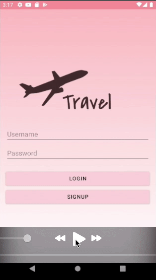
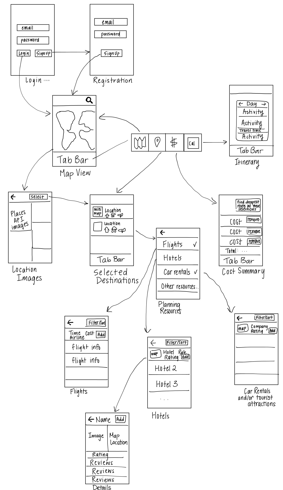

Original App Design Project
===

# Travel

Trello board: https://trello.com/b/hGXlKhIV/codepath

## Table of Contents
1. [Overview](#Overview)
2. [Walkthroughs](#Walkthroughs)
3. [Product Spec](#Product-Spec)
4. [Wireframes](#Wireframes)
5. [Schema](#Schema)

## Overview
### Description
This app makes planning trips easy, allowing users to find all necessary information from plane ticket costs to hotels. It also allows users to look at images of places, filter locations by characteristics, and upload their own photos from traveling. The app will estimate costs, and can suggest trips with multiple destinations minimizing cost.

### App Evaluation
[Evaluation of your app across the following attributes]
- **Category:** Travel/Productivity
- **Mobile:** No website, just a mobile app. Uses maps and camera.
- **Story:** Allows users to organize their traveling plans more easily. Also allows user to store their vacation/travel photos to appear on the map.
- **Market:** Anyone who is traveling, whether for vacations or for business trips, could find this app useful and time-saving. This is more aimed at trips traveling via plane.
- **Habit:** Users would use this app when they are planning a trip, or while on the trip. Users can also upload their photos from the trips so that they can see photo clusters while in map view.
- **Scope:** This app will start out with just a map view that leads to images of the location when clicked. Then it will continue to incorporate resources like plane ticket costs, hotels, restaurants, and car rentals. With sufficient resources, the app can expand to help plan trips with multiple destinations that minimizes costs.

## Walkthroughs

   
 

Walkthroughs of updated/additional screens:

  

## Product Spec

### 1. User Stories (Required and Optional)

**Required Must-have Stories**

- [x] User can see and click on locations in world map
- [x] User can choose location by typing name
- [x] User can see generated itinerary of trip and edit it
- [x] User can see calendar with trip dates marked
- [x] User can see flight options to chosen destination
- [x] User can find hotels
- [x] User can see cost summary for chosen resources and add additional expenses
- [x] User can see list of resources (hotel, flight)
- [x] User can create new account
- [x] User can login

**Optional Nice-to-have Stories**

- [x] User can find car rentals at destination
- [x] User can find popular tourist spots at destination
- [x] User can sort and filter results for tickets, tourist spots, and rentals
- [x] User can manually create and add plans in calendar
- [x] Scheduling algorithm considers mealtimes
- [ ] Scheduling algorithm considers time on road between events
- [x] User can find restaurants at destination
- [x] User can see ratings for resources (hotel, airline, etc.)
- [x] User can see reviews for resources 
- [ ] User can view schedule showing when events overlap

### 2. Screen Archetypes

* Login Screen
   * User can login
* Registration Screen
   * User can create new account
* Map View
    * User can see and click on locations on the map
    * User can choose location by typing name
* Stream
    * User can see images of selected location
    * User can see flight options to chosen location
    * User can find hotels 
    * User can see cost summary for chosen resources and add additional expenses
    * User can see list of resources (hotel, flight)
    * Selected Destinations

### 3. Navigation

**Tab Navigation** (Tab to Screen)

* Map View
* Selected Destinations
* Cost Summary

**Flow Navigation** (Screen to Screen)

* Login Screen
    * Map View
    * Registration Screen
* Registration Screen
    * Map View
* Map View
    * Stream Screen (location images)
* Stream Screen (location images)
    * Stream Screen (list of available resources like hotels, flights, etc.)
    * Creation Screen (if time allows to implement uploading images)
* Stream Screen (selected locations)
    * Stream Screen (list of available resources)
* Stream Screen (list of available resources)
    * Stream Screen (flight options)
    * Stream Screen (hotel options)
    * Stream Screen (any other implemented resources)
* Stream Screen (flight and hotel each)
    * Details Screen (if time allows to implement including reviews of resources)

## Wireframes


## Schema 

### Models
Destination

| Property      | Type          | Description  |
| ------------- |---------------| -------------|
| objectId      | String | unique id for trip destination (default field) |
| author | Pointer to User | user who planned to go to this destination |
| latitude | String | latitude of the selected destination |
| longitude | String | longitude of the selected destination |
| order | Number | which stop this destination is on the trip (1 for first/only stop) |

Flight

| Property      | Type          | Description  |
| ------------- |---------------| -------------|
| objectId      | String | unique id for flight (default field) |
| author | Pointer to User | user who chose this flight |
| destination | Pointer to Destination | destination (object) for this flight |
| departFromCode | String | IATA airport code of where flight departs from |
| arriveAtCode | String | IATA airport code where flight arrives at |
| departFrom | String | destination airport name |
| arriveAt | String | origin airport name |
| cost | String | cost of flight |
| directFlight | Boolean | whether or not it's a diret flight |
| departTime | String | time that flight departs |
| manualCost | String | the cost the user adjusts manually |

Hotel

| Property      | Type          | Description  |
| ------------- |---------------| -------------|
| objectId      | String | unique id for hotel (default field) |
| author | Pointer to User | user who chose this hotel |
| destination | Pointer to Destination | destination (object) for this flight |
| name | String | name of hotel |
| latitude | String | latitude of selected hotel |
| longitdue | String | longitude of selected hotel |
| checkin | String | checkin date |
| checkout | String | checkout date |
| cost | String | cost of booking |
| beds | Number | number of beds in hotel room |
| manual | Boolean | true if the user chooses to manually adjust the cost |
| manualCost | String | the cost the user adjusts manually |


### Networking
- Destination Planning screen
    - (Read/GET) Query all data concerning planned resources
        ```java
        ParseQuery<Post> query = ParseQuery.getQuery(Flight.class);
        query.include(Flight.KEY_USER);
        query.include(Flight.KEY_DESTINATION);
        query.whereEqualTo(Flight.KEY_DESTINATION, currentDestinationId);
        query.query.findInBackground(new FindCallback<Post>() {
            @Override
            public void done(Flight flight, ParseException e) {
                if (e != null) {
                    Log.e(TAG, "Issue with getting flight", e);
                    Toast.makeText(context, "Error: Unable to load flight details", Toast.LENGTH_SHORT).show();
                    return;
                }
                Toast.makeText(context, "Found flight details", Toast.LENGTH_SHORT).show();
            }
        });
        
        ParseQuery<Post> query = ParseQuery.getQuery(Hotel.class);
        query.include(Hotel.KEY_USER);
        query.include(Hotel.KEY_DESTINATION);
        query.whereEqualTo(Hotel.KEY_DESTINATION, currentDestinationId);
        query.query.findInBackground(new FindCallback<Post>() {
            @Override
            public void done(Flight flight, ParseException e) {
                if (e != null) {
                    Log.e(TAG, "Issue with getting hotel", e);
                    Toast.makeText(context, "Error: Unable to load hotel details", Toast.LENGTH_SHORT).show();
                    return;
                }
                Toast.makeText(context, "Found hotel details", Toast.LENGTH_SHORT).show();
            }
        });
        ```
    - (Update/PUT) Update selected hotel/flight
    - (Delete) Delete existing hotel/flight choice
- Cost screen
    - (Read/GET) Query all cost data
    - (Update/PUT) Manually update cost for selection
    
